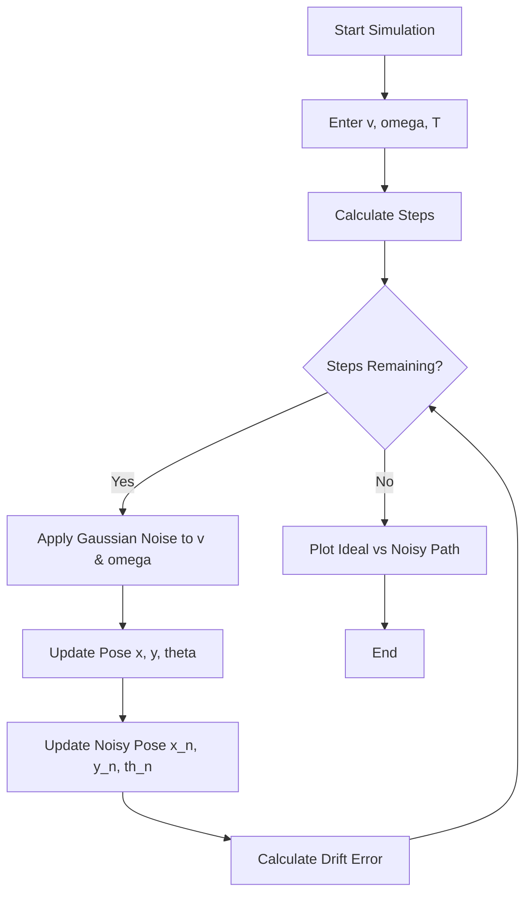
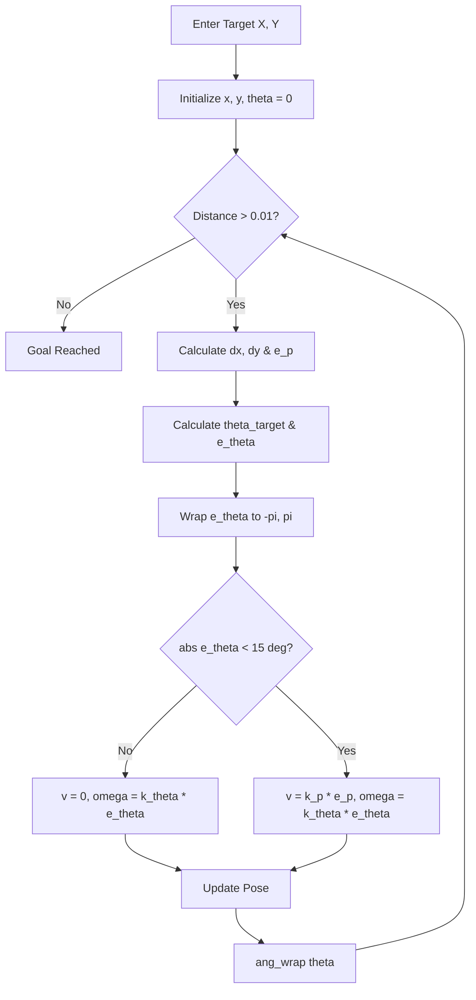
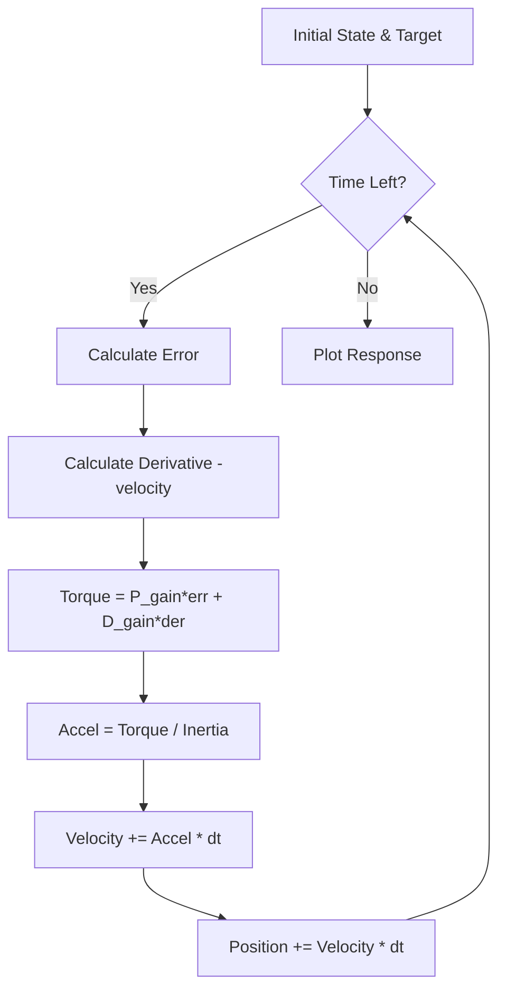

# **Autonomous Mobile Robot (AMR) Control Stack**

*A First-Principles Guide to Motion, Control, and Physics*  
This repository serves as a progressive educational journey into the world of robotics. It tracks the evolution of a robot from a "blind" mechanical system to an "intelligent" autonomous agent.

## **Core Variables Reference**

| Variable | Description | Math Symbol | Code Name |
| :---- | :---- | :---- | :---- |
| **Distance Error** | Euclidean distance to goal | $e\_p$ | e\_p |
| **Heading Error** | Shortest angle to face goal | $e\_\\theta$ | e\_theta |
| **Linear Gain** | Aggressiveness of approach | $k\_p$ | kp |
| **Angular Gain** | Aggressiveness of rotation | $k\_\\theta$ | ktheta |
| **Damping** | The "Braking" force (Derivative) | $k\_d$ | kd |
| **Inertia** | Resistance to change in motion | $J$ | J |

## **Project Structure and Learning Modules**

### **1\. dead\_reckoning\_model.py — The Blind Robot**

**Concept:** Open-Loop Navigation and Stochastic Noise.  
In this module, we explore the **Differential Drive Kinematics**. The robot assumes that if it tells its motors to spin at a certain rate, it will move exactly as planned.

* **The Math:** We update the position $(x, y)$ based on the current heading $(\theta)$ and velocity $(v)$:

$$
x_{t+1} = x_t + v \cdot \cos(\theta) \cdot \Delta t
$$

$$
y_{t+1} = y_t + v \cdot \sin(\theta) \cdot \Delta t
$$

* **The Reality of Noise:** In the real world, "Commanded Velocity" $\neq$ "Actual Velocity." We simulate this using **Gaussian Noise**:

$$
v_{\text{actual}} = v_{\text{cmd}} + \mathcal{N}(0, \sigma^2)
$$

* **Takeaway:** This script proves why **Dead Reckoning** (counting steps) is insufficient. Small errors in $\theta$ accumulate over time, leading to exponential "Drift" in the $x,y$ position.

#### **Logic Flow**

### **2\. velocity\_controlled\_motion.py — The Brain**

**Concept:** Closed-Loop Feedback and The Heading Gate.  
Here, we introduce **Feedback Control**. The robot now "senses" its distance to the target and adjusts its speed dynamically.

* **Coordinate Transformation:** We convert Cartesian coordinates $(x,y)$ into Polar coordinates $(\rho, \theta)$ relative to the goal.  
  * **Distance Error:** 
  
  $$
  e_p = \sqrt{\Delta x^2 + \Delta y^2}
  $$
  * **Desired Heading:** 
  
  $$
  	theta_{tar} = \text{atan2}(\Delta y, \Delta x)
  $$
* **The Heading Gate:** Industrial robots must be safe. A "Heading Gate" prevents the robot from moving forward if it isn't pointing at the target:
  
  $$\text{If } |e_\theta| > 15^\circ \implies v = 0$$
* **Angular Normalization:** We use atan2(sin(e), cos(e)) to ensure the robot turns the shortest way (e.g., turning $-10^\circ$ instead of $+350^\circ$).

#### **Logic Flow**

### **3\. gain\_tuning\_study.py — The Personality**

**Concept:** PID Tuning and Saturation.  
Control gains ($k\_p, k\_\theta$) determine the "character" of the robot.

* **Low Gains:** The robot is sluggish and takes long, lazy turns.  
* **High Gains:** The robot is aggressive, but if gains are too high, the system becomes **unstable** and vibrates or oscillates.  
* **Saturation:** Real motors have a "Top Speed." We implement **Clamping** logic to ensure the software doesn't command speeds the hardware can't achieve:
  
  $$v_{cmd} = \text{clamp}(v, -v_{max}, v_{max})$$
  

### **4\. torque\_sim.py — The Body**

**Concept:** Dynamics, Inertia, and Damping.  
In the previous scripts, we assumed the robot could change speed instantly. In torque\_sim.py, we respect **Newton's Second Law**.

* **The Physics:**
  
  $$
  \tau = J \cdot \alpha \implies \alpha = \frac{\tau}{J}
  $$
  
  Where $\tau$ is Torque, $J$ is Inertia, and $\alpha$ is Angular Acceleration.
  
* **PD Control Law:**
  
  $$
  \tau = (k_p \cdot e) + (k_d \cdot \dot{e})
  $$
  
  The **Proportional (**$k_p$**)** term acts like a spring pulling the robot to the goal.  
  The **Derivative (**$k_d$**)** term acts like a shock absorber (Damping), providing a "counter-torque" proportional to velocity to prevent overshooting the target.

#### **Logic Flow**

## **Future Units**

* **F5 \- Extended Kalman Filter (EKF):** Fusing Noisy Sensors with Motion Models for perfect localization.  
* **F6 \- Obstacle Avoidance:** Using potential fields to navigate around walls.

